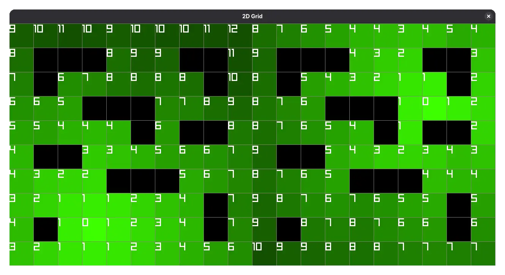

# odin Flowfield


Pathfinding flowfield using Dijstra's pathfinding algorithm.

## Example Usage

a more advanced version can be found in `main.odin` which demonstrates it with multi threading.

```odin
package main

import "core:fmt"
import flowfield "flowfield"

tilemap := []int{
    0, 0, 0, 0, 0, 0, 0, 0, 0, 0,
    0, 1, 1, 1, 0, 0, 0, 1, 1, 0,
    0, 1, 0, 0, 0, 0, 0, 0, 1, 0,
    0, 0, 0, 1, 1, 1, 0, 0, 0, 0,
    0, 0, 0, 0, 0, 1, 0, 1, 1, 0,
    0, 1, 1, 0, 0, 0, 0, 0, 0, 0,
    0, 0, 0, 0, 1, 1, 1, 0, 0, 0,
    0, 0, 0, 0, 0, 0, 0, 0, 1, 0,
    0, 1, 0, 0, 0, 0, 0, 0, 1, 0,
    0, 0, 0, 0, 0, 0, 0, 0, 0, 0
}
grid_width := 10
grid_height := 10
CELL_SIZE :: 64

main :: proc() {
    goal := [2]int{7,8}

    flowfield.flowfield_init(grid_width, grid_height)
    cost_field := flowfield.calculate_flow_field(goal, tilemap)
    flow_field, visual_field := flowfield.generate_flow_vectors(cost_field, tilemap)
}
```